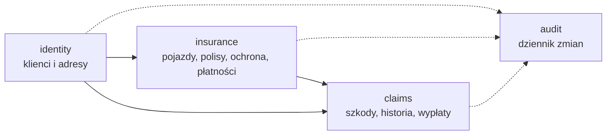
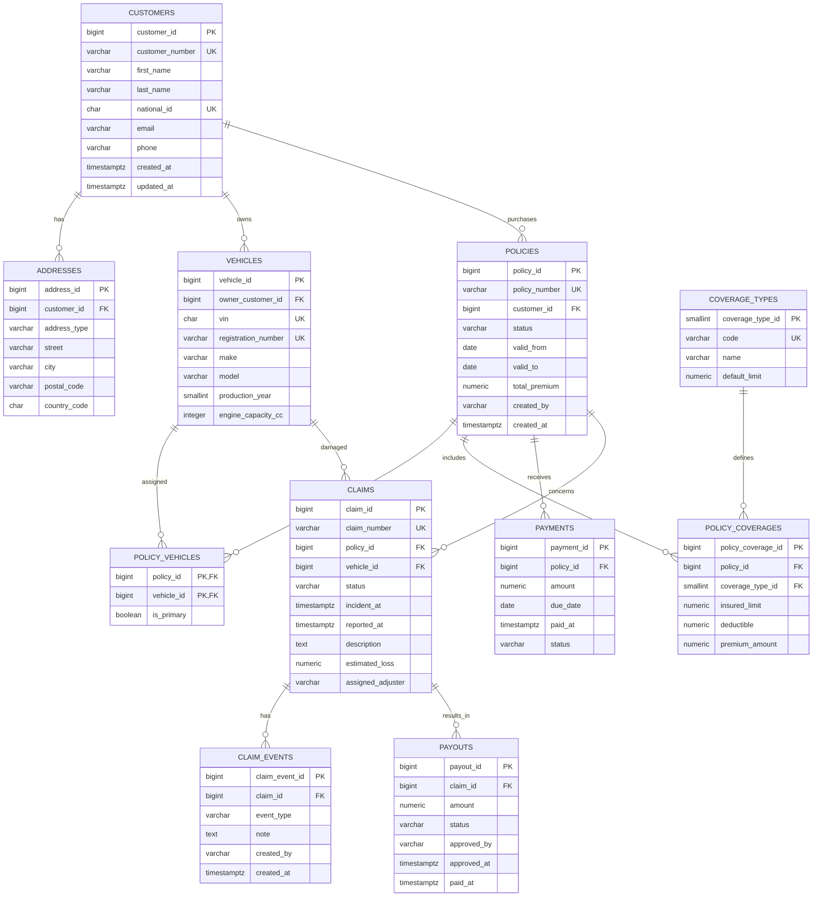
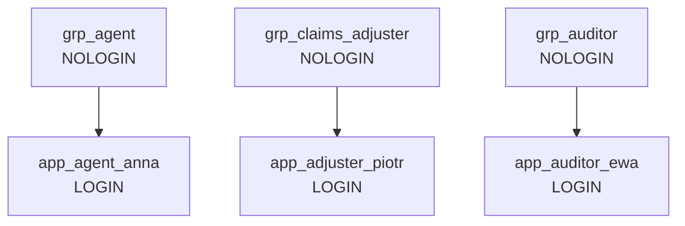

# Projekt bazy danych

## 1. Baza i schematy

Nazwa bazy:

```text
vehicle_insurance
```

Schematy:

- `identity` - klienci i adresy,
- `insurance` - pojazdy, polisy, zakresy ochrony i płatności,
- `claims` - szkody, zdarzenia i wypłaty,
- `audit` - dziennik operacji.

Schemat `public` nie będzie używany do tabel biznesowych. Domyślne prawo `CREATE` w `public` zostanie odebrane użytkownikom aplikacyjnym.

## 2. Diagram kontekstowy danych



## 3. ERD



Tabela `audit.activity_log` nie jest połączona klasycznym kluczem obcym z każdą tabelą. Przechowuje nazwę schematu, tabeli i klucz rekordu jako metadane.

## 4. Specyfikacja tabel

### 4.1. `identity.customers`

Cel: podstawowa kartoteka klientów.

Najważniejsze reguły:

- `customer_number` jest generowany i unikalny,
- `national_id` ma 11 cyfr,
- adres e-mail może być pusty, ale jeśli istnieje, musi być unikalny w danych demonstracyjnych,
- znaczniki czasu są ustawiane automatycznie.

### 4.2. `identity.addresses`

Cel: możliwość posiadania adresu zamieszkania i korespondencyjnego.

Reguły:

- dozwolone typy: `HOME`, `CORRESPONDENCE`,
- kod kraju ma format ISO alpha-2,
- usunięcie klienta nie jest standardową operacją aplikacji.

### 4.3. `insurance.vehicles`

Cel: pojazdy należące do klientów.

Reguły:

- VIN ma 17 znaków,
- VIN i numer rejestracyjny są unikalne,
- rok produkcji mieści się w racjonalnym zakresie,
- pojemność silnika jest dodatnia.

### 4.4. `insurance.policies`

Cel: nagłówek umowy ubezpieczenia.

Statusy:

- `DRAFT`,
- `ACTIVE`,
- `SUSPENDED`,
- `EXPIRED`,
- `CANCELLED`.

Reguły:

- `valid_to >= valid_from`,
- składka nie jest ujemna,
- numer polisy jest unikalny,
- aktywacja wymaga pojazdu i co najmniej jednego zakresu ochrony.

### 4.5. `insurance.policy_vehicles`

Cel: relacja wiele-do-wielu między polisą i pojazdem.

Reguły:

- para `(policy_id, vehicle_id)` jest kluczem głównym,
- w demonstracyjnym MVP polisa ma zwykle jeden pojazd,
- model pozostawia możliwość polis flotowych.

### 4.6. `insurance.coverage_types`

Cel: słownik zakresów ochrony.

Dane początkowe:

- `OC`,
- `AC`,
- `ASSISTANCE`,
- `NNW`.

### 4.7. `insurance.policy_coverages`

Cel: zakres ochrony wybrany dla konkretnej polisy.

Reguły:

- unikalna para polisa + typ ochrony,
- limit, udział własny i składka nie są ujemne.

### 4.8. `insurance.payments`

Cel: harmonogram i stan opłacenia składki.

Statusy:

- `PENDING`,
- `PAID`,
- `OVERDUE`,
- `CANCELLED`.

### 4.9. `claims.claims`

Cel: główny rekord szkody.

Statusy:

- `REPORTED`,
- `UNDER_REVIEW`,
- `APPROVED`,
- `REJECTED`,
- `CLOSED`.

Reguły:

- szkoda wskazuje polisę i pojazd,
- pojazd musi należeć do zakresu polisy,
- data zdarzenia nie może być późniejsza niż data zgłoszenia,
- szacowana strata nie może być ujemna.

### 4.10. `claims.claim_events`

Cel: historia obsługi szkody.

Przykładowe typy:

- `REPORTED`,
- `DOCUMENT_RECEIVED`,
- `INSPECTION`,
- `STATUS_CHANGED`,
- `DECISION`,
- `NOTE`.

Tabela jest dopisywana, nie aktualizowana.

### 4.11. `claims.payouts`

Cel: decyzje i realizacja wypłat.

Statusy:

- `PROPOSED`,
- `APPROVED`,
- `PAID`,
- `REJECTED`.

Reguły:

- kwota jest dodatnia,
- agent nie posiada prawa `INSERT` ani `UPDATE`,
- audytor posiada tylko `SELECT`.

### 4.12. `audit.activity_log`

Proponowane kolumny:

```text
activity_id        bigint
occurred_at        timestamptz
database_user      text
application_name   text
client_addr        inet
action             text
schema_name        text
table_name         text
record_key         jsonb
old_data           jsonb
new_data           jsonb
transaction_id     bigint
```

Zapis jest realizowany funkcją triggerową `SECURITY DEFINER`. Konta aplikacyjne nie otrzymują bezpośredniego `INSERT`, `UPDATE` ani `DELETE` do dziennika.

## 5. Indeksy

Minimalny zestaw:

- unikalny indeks `customers(customer_number)`,
- unikalny indeks `customers(national_id)`,
- indeks `customers(last_name, first_name)`,
- unikalny indeks `vehicles(vin)`,
- unikalny indeks `vehicles(registration_number)`,
- unikalny indeks `policies(policy_number)`,
- indeks `policies(customer_id, status)`,
- indeks `policies(valid_from, valid_to)`,
- unikalny indeks `claims(claim_number)`,
- indeks `claims(policy_id)`,
- indeks `claims(status, reported_at)`,
- indeks `claim_events(claim_id, created_at)`,
- indeks `payments(status, due_date)`,
- indeks `activity_log(occurred_at)`,
- indeks `activity_log(schema_name, table_name)`.

## 6. Widoki

### `insurance.active_policy_summary`

Łączy klienta, polisę, pojazd i zakresy. Używany przez agentów oraz likwidatorów.

### `claims.open_claim_summary`

Pokazuje otwarte szkody wraz z polisą, klientem, pojazdem i ostatnim zdarzeniem.

### `audit.recent_activity`

Ograniczony widok ostatnich operacji przeznaczony dla audytora.

Widoki upraszczają aplikację i pozwalają nadawać bezpieczniejsze prawa odczytu.

## 7. Role i macierz uprawnień

Legenda:

- `R` - SELECT,
- `C` - INSERT,
- `U` - UPDATE,
- `D` - DELETE,
- `-` - brak uprawnienia.

| Obiekt | Agent | Likwidator | Audytor |
|---|---|---|---|
| `identity.customers` | R/C/U | R | R |
| `identity.addresses` | R/C/U | R | R |
| `insurance.vehicles` | R/C/U | R | R |
| `insurance.policies` | R/C/U | R | R |
| `insurance.policy_vehicles` | R/C/D | R | R |
| `insurance.coverage_types` | R | R | R |
| `insurance.policy_coverages` | R/C/U/D | R | R |
| `insurance.payments` | R/C/U | R | R |
| `claims.claims` | R/C | R/C/U | R |
| `claims.claim_events` | R/C | R/C | R |
| `claims.payouts` | R | R/C/U | R |
| `audit.activity_log` | - | - | R |

W projekcie nie przewiduje się biznesowego `DELETE` dla klientów, polis, szkód i wypłat. Zmiana statusu zastępuje usuwanie. Celowe `DELETE` w demonstracji backupu wykonuje wyłącznie administrator techniczny.

## 8. Role PostgreSQL



Każda grupa otrzymuje:

- `CONNECT` do właściwej bazy,
- `USAGE` tylko do potrzebnych schematów,
- prawa do konkretnych tabel, sekwencji i widoków,
- odpowiednie `ALTER DEFAULT PRIVILEGES` dla przyszłych obiektów.

## 9. Funkcje i triggery

Planowane funkcje:

- generowanie numeru klienta,
- generowanie numeru polisy,
- generowanie numeru szkody,
- walidacja aktywacji polisy,
- walidacja zgodności pojazdu ze szkodą,
- ustawianie `updated_at`,
- audyt zmian.

Funkcje generujące numery powinny opierać się na sekwencjach, a nie `MAX(id)`, aby działały bezpiecznie współbieżnie.

## 10. Dane demonstracyjne

Minimalny zestaw:

- 8 klientów,
- 10 pojazdów,
- 10 polis, w tym aktywne, wygasłe i robocze,
- wszystkie cztery rodzaje ochrony,
- 12 płatności,
- 5 szkód o różnych statusach,
- historia zdarzeń dla każdej szkody,
- 2 wypłaty,
- wpisy audytowe generowane przez operacje.

Wszystkie dane muszą być jednoznacznie fikcyjne.

## 11. Kolejność migracji

1. utworzenie bazy,
2. utworzenie schematów,
3. utworzenie typów lub ograniczeń statusów,
4. tabele `identity`,
5. tabele `insurance`,
6. tabele `claims`,
7. tabela i funkcje `audit`,
8. indeksy,
9. widoki,
10. funkcje biznesowe i triggery,
11. role grupowe i logujące,
12. GRANT i default privileges,
13. dane słownikowe,
14. dane demonstracyjne,
15. testy uprawnień i spójności.

## 12. Testy modelu

### Testy pozytywne

- utworzenie klienta przez agenta,
- utworzenie pojazdu i polisy,
- zgłoszenie szkody,
- aktualizacja szkody przez likwidatora,
- odczyt dziennika przez audytora.

### Testy negatywne

- błędny VIN,
- powtórzony numer polisy,
- polisa z datą końca wcześniejszą od początku,
- szkoda dla pojazdu nieobjętego polisą,
- ujemna wypłata,
- wypłata utworzona przez agenta,
- edycja polisy przez likwidatora,
- modyfikacja danych przez audytora,
- bezpośrednia zmiana dziennika audytowego.

