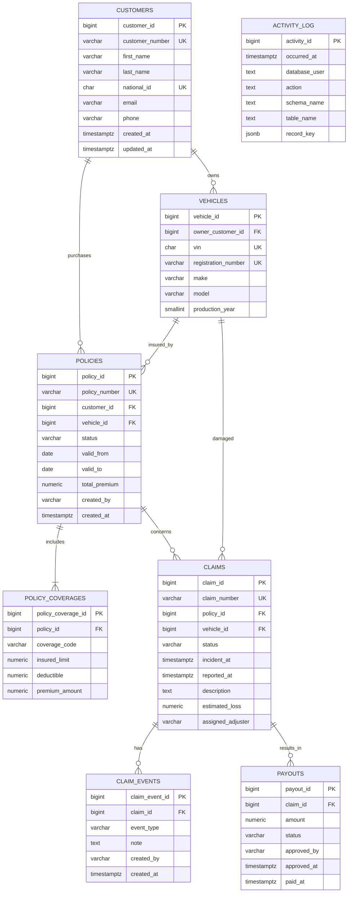

# Projekt bazy danych

## 1. Baza i schematy

Nazwa bazy to `vehicle_insurance`. Model obowiązkowy zawiera dokładnie trzy
schematy biznesowe:

- `insurance` — klienci, pojazdy, polisy i zakresy ochrony;
- `claims` — szkody, historia obsługi i wypłaty;
- `audit` — dziennik operacji.

Schemat `public` nie przechowuje tabel biznesowych. Domyślne prawo `CREATE` w
`public` zostaje odebrane rolom aplikacyjnym.

## 2. Zakres modelu

Model celowo ograniczono do ośmiu tabel:

1. `insurance.customers`;
2. `insurance.vehicles`;
3. `insurance.policies`;
4. `insurance.policy_coverages`;
5. `claims.claims`;
6. `claims.claim_events`;
7. `claims.payouts`;
8. `audit.activity_log`.

Nie ma osobnego modułu tożsamości, adresów, harmonogramu płatności składek,
słowników ochrony ani tabeli łącznikowej polisa–pojazd. W MVP jedna polisa
dotyczy jednego pojazdu, a kod zakresu ochrony jest przechowywany bezpośrednio w
`policy_coverages`.

## 3. ERD



`audit.activity_log` nie ma klucza obcego do każdej tabeli. Identyfikuje obiekt
przez nazwę schematu, tabeli i klucz rekordu zapisany jako JSON.

## 4. Specyfikacja tabel

### 4.1. `insurance.customers`

Kartoteka klientów. `customer_number` i `national_id` są unikalne,
`national_id` ma 11 cyfr, a znaczniki czasu są ustawiane automatycznie. E-mail
może być pusty; jeśli występuje, dane demonstracyjne nie mogą go duplikować.

### 4.2. `insurance.vehicles`

Pojazdy należące do klientów. `owner_customer_id` wskazuje klienta. VIN ma 17
znaków, VIN i numer rejestracyjny są unikalne, a rok produkcji ma racjonalne
ograniczenie.

### 4.3. `insurance.policies`

Nagłówek polisy dla jednego klienta i jednego pojazdu. Statusy:
`DRAFT`, `ACTIVE`, `SUSPENDED`, `EXPIRED`, `CANCELLED`.

Reguły:

- numer polisy jest unikalny;
- `valid_to >= valid_from`;
- składka nie jest ujemna;
- pojazd należy do klienta wskazanego w polisie;
- aktywacja wymaga co najmniej jednego rekordu `policy_coverages`.

### 4.4. `insurance.policy_coverages`

Zakresy ochrony polisy. Dozwolone kody w MVP: `OC`, `AC`, `ASSISTANCE`, `NNW`.
Para `(policy_id, coverage_code)` jest unikalna. Limit, udział własny i część
składki nie są ujemne.

### 4.5. `claims.claims`

Główny rekord szkody. Statusy: `REPORTED`, `UNDER_REVIEW`, `APPROVED`,
`REJECTED`, `CLOSED`.

Szkoda wskazuje polisę i pojazd objęty tą polisą. Data zdarzenia nie może być
późniejsza niż data zgłoszenia, a szacowana strata nie może być ujemna.

### 4.6. `claims.claim_events`

Dopisywana historia obsługi szkody. Przykładowe typy: `REPORTED`,
`DOCUMENT_RECEIVED`, `INSPECTION`, `STATUS_CHANGED`, `DECISION`, `NOTE`.
Zdarzeń nie aktualizuje się ani nie usuwa w zwykłym przepływie biznesowym.

### 4.7. `claims.payouts`

Decyzje i realizacja wypłat odszkodowań. Statusy: `PROPOSED`, `APPROVED`,
`PAID`, `REJECTED`. Kwota musi być dodatnia. Agent nie ma prawa tworzenia ani
zmiany wypłat.

### 4.8. `audit.activity_log`

Minimalny dziennik operacji:

```text
activity_id        bigint
occurred_at        timestamptz
database_user      text
application_name   text
client_addr        inet
action             text
schema_name        text
table_name         text
record_key         jsonb
old_data           jsonb
new_data           jsonb
transaction_id     bigint
```

Wpisy tworzy funkcja triggerowa `SECURITY DEFINER` z bezpiecznym
`search_path`. Konta aplikacyjne nie otrzymują bezpośrednich praw modyfikacji
dziennika.

## 5. Indeksy

Minimalny zestaw poza indeksami tworzonymi przez PK i UNIQUE:

- `customers(last_name, first_name)`;
- `vehicles(owner_customer_id)`;
- `policies(customer_id, status)`;
- `policies(vehicle_id, status)`;
- `policies(valid_from, valid_to)`;
- `policy_coverages(policy_id)`;
- `claims(policy_id)`;
- `claims(vehicle_id)`;
- `claims(status, reported_at)`;
- `claim_events(claim_id, created_at)`;
- `payouts(claim_id, status)`;
- `activity_log(occurred_at)`;
- `activity_log(schema_name, table_name)`.

## 6. Widoki i funkcje pomocnicze

Widoki są opcjonalnymi obiektami SQL, a nie dodatkowymi tabelami. Dopuszczalne
minimalne widoki:

- `insurance.active_policy_summary`;
- `claims.open_claim_summary`;
- `audit.recent_activity`.

Planowane funkcje:

- generowanie numeru klienta, polisy i szkody z sekwencji;
- ustawianie `updated_at`;
- walidacja właściciela pojazdu i aktywacji polisy;
- rejestracja zmiany statusu szkody wraz z `claim_events`;
- audyt zmian.

## 7. Role i macierz uprawnień

Legenda: `R` — SELECT, `C` — INSERT, `U` — UPDATE, `-` — brak prawa.

| Obiekt | Agent | Likwidator | Audytor |
|---|---|---|---|
| `insurance.customers` | R/C/U | R | R |
| `insurance.vehicles` | R/C/U | R | R |
| `insurance.policies` | R/C/U | R | R |
| `insurance.policy_coverages` | R/C/U | R | R |
| `claims.claims` | R | R/C/U | R |
| `claims.claim_events` | R | R/C | R |
| `claims.payouts` | R | R/C/U | R |
| `audit.activity_log` | - | - | R |

W zwykłych przepływach biznesowych żadna grupa nie otrzymuje `DELETE`.
Kontrolny `DELETE` w demonstracji backupu wykonuje administrator techniczny w
ściśle wskazanym środowisku.

Grupy `NOLOGIN`:

- `grp_agent`;
- `grp_claims_adjuster`;
- `grp_auditor`.

Role logujące:

- `app_agent_anna` → `grp_agent`;
- `app_adjuster_piotr` → `grp_claims_adjuster`;
- `app_auditor_ewa` → `grp_auditor`.

Uprawnienia są nadawane grupom. Każda grupa otrzymuje tylko wymagane `CONNECT`,
`USAGE`, prawa do tabel, sekwencji i widoków oraz odpowiednie default
privileges. Role logujące nie mają `SUPERUSER`, `CREATEDB`, `CREATEROLE`,
`REPLICATION` ani `BYPASSRLS`.

## 8. Dane demonstracyjne

Minimalny zestaw:

- 8 fikcyjnych klientów;
- 10 pojazdów;
- 10 polis o różnych statusach;
- wszystkie cztery kody ochrony;
- 5 szkód o różnych statusach;
- historia każdej szkody;
- 2 wypłaty;
- wpisy audytowe powstałe w wyniku operacji.

## 9. Kolejność migracji

1. baza i odebranie zbędnych praw `public`;
2. schematy `insurance`, `claims`, `audit`;
3. tabele `insurance`;
4. tabele `claims`;
5. tabela i funkcje `audit`;
6. ograniczenia i indeksy;
7. funkcje biznesowe, triggery i opcjonalne widoki;
8. grupy i role logujące;
9. GRANT, REVOKE i default privileges;
10. dane demonstracyjne;
11. testy spójności i uprawnień.

## 10. Testy modelu i uprawnień

Testy pozytywne:

- agent odczytuje i tworzy klienta, pojazd oraz polisę;
- likwidator odczytuje polisę, tworzy szkodę i zmienia jej status;
- audytor odczytuje dane i `audit.activity_log`;
- trigger zapisuje rzeczywistego `current_user`.

Testy negatywne:

- błędny VIN;
- powtórzony numer polisy;
- odwrócony zakres dat polisy;
- polisa dla pojazdu innego klienta;
- szkoda dla pojazdu nieobjętego polisą;
- ujemna wypłata;
- utworzenie wypłaty przez agenta;
- edycja polisy przez likwidatora;
- modyfikacja danych przez audytora;
- bezpośrednia modyfikacja dziennika audytowego.

Testy uprawnień muszą być wykonywane jako rzeczywiste role logujące, nie przez
sprawdzanie samych deklaracji GRANT.

