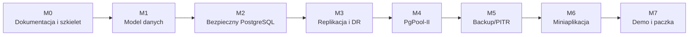

# Szczegółowy plan realizacji

## 1. Zasady prowadzenia prac

Każdy etap powinien kończyć się małym, sprawdzalnym rezultatem. Nie należy równocześnie budować całej infrastruktury i aplikacji bez działającego punktu kontrolnego.

Przy każdym zadaniu zapisujemy:

- pliki źródłowe,
- komendy wykonane na hoście,
- komendy wykonane w kontenerze,
- komendy SQL,
- oczekiwany wynik,
- rzeczywisty wynik,
- zrzut ekranu, jeśli jest potrzebny do oddania.

## 2. Kamienie milowe



Niektóre prace nad aplikacją mogą rozpocząć się po M1 równolegle z infrastrukturą, używając pojedynczej lokalnej bazy.

## 3. Etap 0 - ustalenie sposobu pracy

### Cel

Przygotować repozytorium do bezpiecznej współpracy.

### Zadania

1. Utworzyć `README.md`.
2. Utworzyć `.gitignore`.
3. Utworzyć `.env.example` bez prawdziwych haseł.
4. Ustalić nazwy gałęzi:
   - `main`,
   - `feature/database`,
   - `feature/infrastructure`,
   - `feature/application`,
   - `feature/documentation`.
5. Ustalić konwencję commitów, np. `feat:`, `fix:`, `docs:`, `test:`.
6. Ustalić katalogi zgodnie z PRD.
7. Dodać checklistę przeglądu zmian.

### Rezultat

Repozytorium ma stabilną strukturę i nie śledzi danych PostgreSQL, sekretów, backupów ani plików tymczasowych.

### Kryteria akceptacji

- `git status` nie pokazuje katalogów danych,
- `.env` jest ignorowany,
- nowa osoba potrafi z README znaleźć dokumentację.

## 4. Etap 1 - kontrakt architektoniczny

### Cel

Zamrozić podstawowe decyzje przed implementacją.

### Zadania

1. Zweryfikować nazwy hostów.
2. Zweryfikować podsieci Docker pod kątem konfliktów z hostem.
3. Potwierdzić porty wystawiane na hosta.
4. Potwierdzić wersje:
   - PostgreSQL,
   - repmgr,
   - PgPool-II,
   - pgBackRest,
   - Python.
5. Ustalić, które kontenery budują własne obrazy.
6. Zapisać decyzje w ADR:
   - replikacja fizyczna zamiast natywnej PgPool-II,
   - PgPool-II zamiast samego HAProxy,
   - pgBackRest/PITR zamiast wyłącznie `pg_dump`,
   - FastAPI/Jinja zamiast rozbudowanego SPA.
7. Wyeksportować diagram architektury do PNG lub PDF do paczki końcowej.

### Rezultat

Architektura nie zawiera sprzeczności między routingiem, replikacją, backupem i bezpieczeństwem.

### Kryteria akceptacji

- wszystkie hosty mają jednoznaczne nazwy,
- każdy przepływ sieciowy ma źródło, cel i port,
- wiadomo, który komponent jest właścicielem każdej konfiguracji.

## 5. Etap 2 - szkielet Docker Compose

### Cel

Uruchomić puste komponenty i sieci bez konfiguracji klastra.

### Zadania

1. Utworzyć trzy sieci Docker.
2. Dodać trwałe wolumeny dla węzłów.
3. Dodać kontenery:
   - `pg-primary`,
   - `pg-standby-a`,
   - `pg-standby-dr`,
   - `pgpool`,
   - `backup-repository`,
   - `insurance-app`.
4. Dodać statyczne IP.
5. Dodać `healthcheck`.
6. Ograniczyć porty wystawione na hosta:
   - aplikacja,
   - opcjonalny port PgPool-II do testów,
   - bez publicznego PCP i bez publicznych portów backendów.
7. Sprawdzić DNS między kontenerami.
8. Zapisać wyniki `docker compose config` i `docker compose ps`.

### Rezultat

Wszystkie kontenery mają prawidłową łączność i kontrolowany zakres ekspozycji.

### Kryteria akceptacji

- brak konfliktów adresacji,
- backendy nie są niepotrzebnie dostępne z hosta,
- healthcheck rozróżnia stan uruchomiony i gotowy.

## 6. Etap 3 - model danych i migracje

### Cel

Utworzyć działającą bazę domenową na pojedynczym primary.

### Zadania

1. Utworzyć bazę `vehicle_insurance`.
2. Utworzyć schematy.
3. Utworzyć tabele w kolejności zależności.
4. Dodać ograniczenia `CHECK`, `UNIQUE` i klucze obce.
5. Dodać indeksy.
6. Dodać funkcje generujące numery.
7. Dodać widoki.
8. Dodać funkcję i triggery audytowe.
9. Dodać dane słownikowe i demonstracyjne.
10. Utworzyć skrypt pełnego resetu wyłącznie dla środowiska developerskiego.
11. Uruchomić testy pozytywne i negatywne.

### Rezultat

Jedna instancja PostgreSQL zawiera kompletny model ubezpieczeń komunikacyjnych.

### Kryteria akceptacji

- `\dn` pokazuje minimum cztery schematy,
- `\dt identity.*`, `insurance.*`, `claims.*`, `audit.*` pokazują oczekiwane tabele,
- błędne dane są odrzucane,
- operacje tworzą wpisy audytowe.

## 7. Etap 4 - role i bezpieczeństwo SQL

### Cel

Zaimplementować rzeczywisty rozdział obowiązków.

### Zadania

1. Odebrać zbędne prawa do `public`.
2. Utworzyć grupy `NOLOGIN`.
3. Utworzyć konta person.
4. Nadać `CONNECT` i `USAGE`.
5. Nadać prawa do tabel, widoków i sekwencji.
6. Ustawić `ALTER DEFAULT PRIVILEGES`.
7. Upewnić się, że aplikacyjne role nie są superuserami.
8. Upewnić się, że nie mają `CREATEDB`, `CREATEROLE`, `REPLICATION` ani `BYPASSRLS`.
9. Dodać testy dozwolonych operacji.
10. Dodać testy odmowy.
11. Zapisać wyniki `\du`, `\dp` i zapytań testowych.

### Rezultat

Trzy persony posiadają różne prawa wymuszane przez PostgreSQL.

### Kryteria akceptacji

- agent nie tworzy wypłaty,
- likwidator nie aktualizuje polisy,
- audytor nie modyfikuje danych,
- audytor odczytuje dziennik,
- agent i likwidator nie modyfikują audytu.

## 8. Etap 5 - bezpieczeństwo transportu i hostów

### Cel

Spełnić kryterium algorytmu hasła i ograniczenia adresów.

### Zadania

1. Ustawić `password_encryption = 'scram-sha-256'`.
2. Wygenerować demonstracyjne CA i certyfikaty serwerowe.
3. Włączyć TLS na PostgreSQL.
4. Skonfigurować klienta aplikacji i PgPool-II.
5. Napisać precyzyjne `pg_hba.conf`.
6. Dodać osobne reguły dla:
   - aplikacji,
   - replikacji,
   - monitoringu,
   - backupu,
   - administracji.
7. Sprawdzić odrzucenie połączenia z niedozwolonej podsieci lub roli.
8. Sprawdzić `SHOW password_encryption`.
9. Sprawdzić `pg_stat_ssl`.
10. Udokumentować, dlaczego SCRAM i TLS rozwiązują różne problemy.

### Rezultat

Połączenia są szyfrowane, hasła są uwierzytelniane SCRAM, a dostęp sieciowy jest ograniczony.

### Kryteria akceptacji

- brak `trust` dla zdalnych kont aplikacji,
- brak biznesowych reguł `0.0.0.0/0`,
- `pg_stat_ssl.ssl = true` dla połączenia aplikacji,
- błędne źródło lub konto nie łączy się.

## 9. Etap 6 - replikacja fizyczna z repmgr

### Cel

Uruchomić jeden primary i dwa standby.

### Zadania

1. Zbudować obraz PostgreSQL z repmgr i pgBackRest.
2. Skonfigurować:
   - `wal_level = replica`,
   - `max_wal_senders`,
   - `max_replication_slots`,
   - `hot_standby`,
   - `wal_keep_size`,
   - `shared_preload_libraries` według potrzeb.
3. Utworzyć konto i bazę repmgr.
4. Zarejestrować primary.
5. Sklonować `pg-standby-a`.
6. Sklonować `pg-standby-dr`.
7. Zarejestrować oba standby.
8. Sprawdzić `repmgr cluster show`.
9. Sprawdzić `pg_stat_replication`.
10. Wykonać zapis na primary i odczyt na obu standby.
11. Sprawdzić, że standby odrzuca zapis bezpośredni.
12. Przygotować skrypt ponownej inicjalizacji klastra.

### Rezultat

Dane są replikowane do dwóch lokalizacji logicznych.

### Kryteria akceptacji

- jeden primary i dwa aktywne standby,
- oba odbierają WAL,
- dane są zgodne,
- brak ręcznego kopiowania rekordów.

## 10. Etap 7 - switchover, failover i powrót węzła

### Cel

Udowodnić odporność na awarię, nie tylko samą replikację.

### Zadania

1. Przygotować skrypt planowanego switchover.
2. Przygotować skrypt awarii całej lokalizacji A.
3. Zatrzymać primary i lokalny standby.
4. Promować `pg-standby-dr`.
5. Sprawdzić `pg_is_in_recovery()`.
6. Wykonać nowy zapis.
7. Zapisać czas przełączenia.
8. Udokumentować mechanizm fencing starego primary.
9. Przywrócić stary węzeł przez `pg_rewind`, `repmgr node rejoin` albo ponowne klonowanie.
10. Sprawdzić stan klastra po powrocie.
11. Przećwiczyć pełny reset do stanu prezentacyjnego.

### Rezultat

Utrata podstawowej lokalizacji nie oznacza utraty danych i trwałego końca pracy.

### Kryteria akceptacji

- DR przyjmuje zapis po promocji,
- stary primary nie działa równocześnie jako niezależny primary,
- istnieje udokumentowana procedura powrotu.

## 11. Etap 8 - PgPool-II

### Cel

Rozdzielać odczyty i zapewnić aplikacji jeden punkt połączenia.

### Zadania

1. Skonfigurować backendy.
2. Włączyć tryb streaming replication.
3. Włączyć load balancing.
4. Skonfigurować health check.
5. Skonfigurować SR check i próg opóźnienia.
6. Skonfigurować `pool_hba.conf`.
7. Skonfigurować `pool_passwd` bez jawnych haseł w repozytorium.
8. Skonfigurować PCP wyłącznie wewnętrznie.
9. Sprawdzić `SHOW POOL_NODES`.
10. Sprawdzić zapis przez PgPool-II.
11. Wykonać 60 odczytów i pogrupować adresy.
12. Wyłączyć standby i powtórzyć test.
13. Wykonać failover primary i potwierdzić aktualizację routingu.

### Rezultat

Aplikacja korzysta z jednego endpointu, a odczyty są rozkładane.

### Kryteria akceptacji

- zapisy trafiają tylko do primary,
- odczyty trafiają do więcej niż jednego zdrowego węzła,
- wyłączony backend nie otrzymuje zapytań,
- aplikacja nie wymaga zmiany adresu po przełączeniu.

## 12. Etap 9 - backup i PITR

### Cel

Odzyskać dane po logicznym uszkodzeniu, którego sama replikacja nie naprawia.

### Zadania

1. Skonfigurować stanza pgBackRest.
2. Skonfigurować repozytorium w lokalizacji B.
3. Skonfigurować `archive_mode` i `archive_command`.
4. Wykonać `stanza-create`.
5. Wykonać pełny backup.
6. Sprawdzić `check` i `info`.
7. Utworzyć rekord kontrolny.
8. Zapisać czas odzyskiwania.
9. Usunąć rekord.
10. Odtworzyć do osobnego kontenera i katalogu.
11. Potwierdzić obecność rekordu.
12. Przygotować dodatkowy `pg_dump` struktury.
13. Udokumentować różnicę między replikacją i backupem.

### Rezultat

Projekt udowadnia możliwość cofnięcia skutków złośliwego `DELETE`.

### Kryteria akceptacji

- `pgbackrest info` pokazuje poprawny backup,
- WAL jest archiwizowany,
- odtworzona instancja zawiera usunięty rekord,
- aktywny klaster nie jest niszczony podczas demonstracji.

## 13. Etap 10 - fundament miniaplikacji

### Cel

Uruchomić aplikację i bezpieczną warstwę dostępu do bazy.

### Zadania

1. Utworzyć projekt FastAPI.
2. Dodać konfigurację przez zmienne środowiskowe.
3. Dodać osobne DSN dla person lub bezpieczną mapę poświadczeń.
4. Dodać fabrykę połączeń psycopg.
5. Ustawić `application_name`.
6. Dodać obsługę utraty połączenia i ponowienia po failover.
7. Dodać prostą sesję wyboru persony.
8. Dodać szablon bazowy, nawigację i komunikaty błędów.
9. Dodać endpoint zdrowia aplikacji.
10. Dodać test połączenia przez PgPool-II.

### Rezultat

Aplikacja uruchamia się w kontenerze i wykonuje zapytania jako wybrana persona.

### Kryteria akceptacji

- UI pokazuje `current_user`,
- połączenie ma TLS,
- aplikacja nie zna hasła superusera,
- restart PgPool-II nie wymaga przebudowy aplikacji.

## 14. Etap 11 - funkcje miniaplikacji

### Cel

Zaimplementować minimalny, prezentacyjny proces biznesowy.

### Zadania

1. Ekran wyboru persony.
2. Dashboard.
3. Lista i formularz klientów.
4. Lista i formularz pojazdów.
5. Lista, szczegóły i formularz polisy.
6. Lista, szczegóły i formularz szkody.
7. Historia szkody.
8. Formularz wypłaty dla likwidatora.
9. Widok audytu.
10. Widok infrastruktury.
11. Akcje pokazujące odmowę uprawnień.
12. Czytelne informacje, który węzeł obsłużył odczyt.

### Rezultat

Miniaplikacja demonstruje domenę oraz uprawnienia bez konieczności ręcznego wpisywania każdego SQL.

### Kryteria akceptacji

- każda persona widzi właściwe funkcje,
- bezpieczeństwo nadal wymusza baza,
- błędy uprawnień są obsługiwane i prezentowane,
- nie ma rozbudowanych funkcji niezwiązanych z oceną.

## 15. Etap 12 - testy automatyczne

### Kategorie

#### Testy SQL

- ograniczenia modelu,
- funkcje i triggery,
- uprawnienia,
- audyt.

#### Testy infrastruktury

- role klastra,
- replikacja danych,
- rozdzielanie odczytów,
- health check,
- failover,
- backup i restore.

#### Testy aplikacji

- wybór persony,
- podstawowe CRUD,
- odmowa dostępu,
- ponowienie połączenia,
- rendering kluczowych stron.

### Kryteria akceptacji

- jedna komenda uruchamia szybki zestaw testów,
- test destrukcyjny ma oddzielne, wyraźne polecenie,
- testy nie wymagają ręcznej edycji plików.

## 16. Etap 13 - skrypty demonstracyjne

### Cel

Zminimalizować ryzyko podczas prezentacji.

### Planowane skrypty

```text
scripts/demo/01-show-architecture.ps1
scripts/demo/02-show-schemas-and-roles.ps1
scripts/demo/03-create-policy.ps1
scripts/demo/04-show-load-balancing.ps1
scripts/demo/05-simulate-site-a-loss.ps1
scripts/demo/06-write-after-failover.ps1
scripts/demo/07-delete-protected-record.ps1
scripts/demo/08-restore-before-delete.ps1
scripts/demo/09-collect-evidence.ps1
```

Każdy skrypt:

- wypisuje nazwę wykonywanego kroku,
- wypisuje host/kontener,
- zatrzymuje się przy błędzie,
- zapisuje wynik do `docs/evidence`,
- nie wymaga wpisywania sekretu.

## 17. Etap 14 - scenariusz prezentacji 7-minutowej

### 0:00-0:45 - problem i architektura

- krytyczna aplikacja ubezpieczeniowa,
- dwie lokalizacje,
- trzy węzły PostgreSQL,
- PgPool-II i backup.

### 0:45-1:30 - baza i bezpieczeństwo

- cztery schematy,
- trzy grupy,
- krótka demonstracja odmowy dostępu.

### 1:30-2:30 - miniaplikacja

- agent tworzy polisę,
- likwidator widzi polisę i obsługuje szkodę.

### 2:30-3:30 - wydajność

- `SHOW POOL_NODES`,
- wynik serii odczytów rozdzielonych między węzły.

### 3:30-5:00 - awaria lokalizacji

- zatrzymanie lokalizacji A,
- promocja DR,
- zapis po failover.

### 5:00-6:15 - backup

- usunięcie rekordu,
- pokaz wcześniej przygotowanego lub szybkiego restore/PITR,
- odzyskany rekord.

### 6:15-7:00 - podsumowanie

- replikacja nie zastępuje backupu,
- PgPool-II zwiększa wydajność,
- SCRAM/TLS/pg_hba i role ograniczają ryzyko.

Należy posiadać plan awaryjny w postaci nagrania i zapisanych wyników.

## 18. Etap 15 - dokumentacja i paczka Moodle

### Wymagane artefakty

1. Diagram architektury z adresami.
2. ERD.
3. Opis aplikacji i założeń.
4. Lista hostów i oprogramowania.
5. Komendy systemowe z wynikami i nazwą hosta.
6. Komendy SQL z wynikami i nazwą hosta.
7. Wszystkie zmodyfikowane konfiguracje.
8. Zrzuty ekranu lub film.
9. Instrukcja uruchomienia.
10. Instrukcja demo.
11. Macierz pokrycia punktów.
12. Archiwum bez katalogów danych, sekretów i ciężkich obrazów.

### Kontrola paczki

- rozpakować ją do pustego katalogu,
- uruchomić instrukcję od początku,
- sprawdzić wszystkie linki,
- sprawdzić kodowanie polskich znaków,
- przeskanować sekrety,
- potwierdzić, że archiwum zawiera wyniki, a nie tylko komendy.

## 19. Propozycja późniejszego podziału pracy

Plan jest celowo modułowy. Możliwy podział:

### Strumień A - baza i aplikacja

- model danych,
- migracje,
- dane demonstracyjne,
- role SQL,
- aplikacja FastAPI,
- testy funkcjonalne.

### Strumień B - infrastruktura

- Docker Compose,
- PostgreSQL/repmgr,
- PgPool-II,
- TLS i sieci,
- pgBackRest,
- failover i testy infrastruktury.

### Strumień wspólny

- integracja,
- dokumentacja wyników,
- skrypty demo,
- próby prezentacji,
- paczka Moodle.

Podział nie powinien być wykonany przed zakończeniem etapów 0-2, ponieważ obie strony muszą korzystać z tych samych nazw, portów i kontraktów.

## 20. Kolejność priorytetów

### Must have

- model danych,
- role,
- replikacja,
- PgPool-II,
- backup/restore,
- bezpieczeństwo,
- dokumentacja.

### Should have

- pełna miniaplikacja demonstracyjna,
- automatyczne zbieranie dowodów,
- switchover i rejoin.

### Could have

- wykresy metryk,
- zaawansowany panel klastra,
- automatyczny failover `repmgrd`,
- dodatkowy PgPool-II z Watchdog.

Elementy `Could have` nie mogą opóźnić funkcji punktowanych.

## 21. Ostateczna checklista 70/70

- [ ] 5/5: opis wymagań aplikacji.
- [ ] 10/10: diagram z hostami, IP, lokalizacjami, bazą i schematami.
- [ ] 5/5: co najmniej dwa działające schematy.
- [ ] 5/5: co najmniej dwie grupy i testy uprawnień.
- [ ] 15/15: replikacja i utrata lokalizacji podstawowej.
- [ ] 15/15: rozdzielanie zapytań i dowody.
- [ ] 5/5: backup i odzyskanie usuniętych danych.
- [ ] 10/10: SCRAM, TLS, ograniczone IP, least privilege i sekrety poza Git.
- [ ] Demo trwa nie dłużej niż 7 minut.
- [ ] Paczka zawiera komendy wraz z wynikami.

