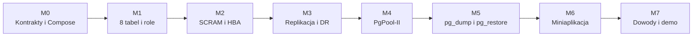

# Plan realizacji

## 1. Zasady

Projekt jest realizowany od najważniejszych mechanizmów PostgreSQL do małej
warstwy demonstracyjnej. Każdy etap kończy się rezultatem, testem i dowodem.
Elementy opcjonalne nie mogą opóźniać zakresu punktowanego.

Przy zadaniu zapisujemy:

- zmienione pliki;
- polecenia hosta, kontenera i SQL;
- oczekiwany oraz rzeczywisty wynik;
- host lub kontener wykonania;
- powiązane wymaganie i punkt oceny;
- niewykonane testy oraz ryzyka.

## 2. Kamienie milowe



Prace nad aplikacją mogą rozpocząć się po zamrożeniu kontraktu ośmiu tabel i
uprawnień, używając tymczasowo pojedynczego PostgreSQL.

## 3. M0 — kontrakty i szkielet Compose

### Zakres

1. Utrzymać pięć usług: `insurance-app`, `pgpool`, `pg-primary`,
   `pg-standby-a`, `pg-standby-dr`.
2. Utrzymać trzy sieci: `frontend_net`, `site_a_net`, `site_b_net`.
3. Utrzymać trzy wolumeny danych: `pg_primary_data`, `pg_standby_a_data`,
   `pg_standby_dr_data`.
4. Zweryfikować nazwy, statyczne IP, porty i przepływy.
5. Nie publikować portów PostgreSQL ani PCP.
6. Publikować PgPool-II wyłącznie na `127.0.0.1` do testów hosta.
7. Zachować placeholdery PgPool-II i aplikacji do czasu budowy właściwych
   obrazów.
8. Utrzymywać ADR-y dla replikacji, routingu, backupu i miniaplikacji.

### Odbiór

- `docker compose --env-file .env.example config --quiet` przechodzi;
- diagram odpowiada dokładnie usługom, sieciom i adresom Compose;
- test struktury repozytorium przechodzi;
- dokumentacja nie deklaruje jeszcze działania mechanizmów, które są
  placeholderami.

## 4. M1 — model danych, migracje i role

### Zakres

1. Utworzyć bazę `vehicle_insurance`.
2. Utworzyć schematy `insurance`, `claims`, `audit`.
3. Utworzyć osiem tabel z `DATABASE_DESIGN.md`.
4. Dodać PK, FK, UNIQUE, CHECK i minimalne indeksy.
5. Dodać sekwencyjne generowanie numerów.
6. Dodać audyt przez bezpieczny trigger.
7. Utworzyć grupy `grp_agent`, `grp_claims_adjuster`, `grp_auditor`.
8. Utworzyć trzy role logujące person.
9. Nadać prawa grupom, odebrać zbędne prawa `public`.
10. Dodać fikcyjne dane i testy pozytywne oraz negatywne.

### Odbiór

- `\dn` pokazuje trzy schematy;
- zapytanie do katalogu pokazuje dokładnie osiem tabel biznesowych;
- `\du` i `\dp` potwierdzają podział praw;
- agent nie tworzy wypłaty;
- likwidator nie zmienia polisy;
- audytor nie modyfikuje danych;
- audytor odczytuje dziennik, lecz go nie zmienia;
- migracje działają od pustej bazy.

## 5. M2 — SCRAM i kontrola sieciowa

### Zakres

1. Ustawić `password_encryption = 'scram-sha-256'`.
2. Utworzyć hasła ról jako SCRAM.
3. Przygotować precyzyjny `pg_hba.conf` dla:
   - PgPool-II i kont aplikacyjnych;
   - replikacji między lokalizacjami;
   - monitoringu;
   - backupu;
   - administracji.
4. Nie używać sieciowego `trust`.
5. Nie tworzyć reguł biznesowych dla `0.0.0.0/0`.
6. Trzymać sekrety w lokalnym `.env` lub równoważnym mechanizmie.
7. Przetestować połączenie dozwolone i odrzucone.

### Odbiór

- `SHOW password_encryption` zwraca `scram-sha-256`;
- role biznesowe uwierzytelniają się przez SCRAM;
- niedozwolona rola lub źródło otrzymuje odmowę;
- PostgreSQL i PCP nie są publikowane na hoście.

TLS jest osobnym rozszerzeniem opcjonalnym.

## 6. M3 — fizyczna replikacja i DR

### Zakres

1. Zbudować obraz PostgreSQL z repmgr.
2. Skonfigurować parametry WAL, hot standby i sloty.
3. Utworzyć ograniczone konto oraz bazę repmgr.
4. Zarejestrować `pg-primary`.
5. Sklonować i zarejestrować `pg-standby-a`.
6. Sklonować i zarejestrować `pg-standby-dr`.
7. Potwierdzić replikację danych i brak bezpośredniego zapisu na standby.
8. Przygotować skrypt utraty lokalizacji A.
9. Odgrodzić stare primary i promować DR ręcznie przez repmgr.
10. Potwierdzić zapis na nowym primary.
11. Opisać ręczny rejoin lub ponowne klonowanie starych węzłów.

### Odbiór

- `repmgr cluster show` pokazuje jeden primary i dwa standby;
- `pg_stat_replication` pokazuje dwa odbiorniki;
- dane zapisane na primary są widoczne na obu standby;
- zatrzymane zostają oba węzły lokalizacji A;
- `pg-standby-dr` po promocji zwraca `pg_is_in_recovery() = false`;
- nowy zapis działa, a split-brain nie powstaje.

Automatyczny `repmgrd`, `pg_rewind` i automatyczny rejoin są opcjonalne.

## 7. M4 — PgPool-II

### Zakres

1. Zastąpić placeholder właściwym, przypiętym obrazem PgPool-II.
2. Skonfigurować trzy backendy w trybie streaming replication.
3. Włączyć routing zapisów do primary.
4. Włączyć load balancing bezpiecznych odczytów.
5. Skonfigurować health check, SR check i próg opóźnienia.
6. Skonfigurować `pool_hba.conf` oraz bezpieczne poświadczenia.
7. Pozostawić PCP wewnątrz sieci kontenerowej.
8. Zweryfikować routing przed i po awarii backendu.
9. Zintegrować ręczny failover DR z odświeżeniem stanu PgPool-II.

### Odbiór

- aplikacja używa wyłącznie `pgpool:9999`;
- zapis przez PgPool-II trafia do primary;
- seria co najmniej 60 niezależnych `SELECT` pokazuje więcej niż jeden zdrowy
  backend;
- `SHOW POOL_NODES` odpowiada rzeczywistemu stanowi;
- niedostępny lub nadmiernie opóźniony backend nie otrzymuje zwykłych odczytów;
- po promocji DR zapis nadal używa tego samego endpointu.

Watchdog i drugi PgPool-II są opcjonalne.

## 8. M5 — backup i odtworzenie

### Zakres

1. Utworzyć jednoznaczny rekord kontrolny.
2. Wykonać `pg_dump --format=custom`.
3. Zapisać dump poza wolumenami aktywnego klastra i poza Git.
4. Usunąć rekord z aktywnej bazy.
5. Potwierdzić, że `DELETE` dotarł na standby.
6. Utworzyć oddzielną bazę `vehicle_insurance_restore`.
7. Wykonać `pg_restore`.
8. Pokazać odzyskany rekord.
9. Zapisać czas, wynik i RPO.

### Odbiór

- plik jest poprawnym dumpem custom;
- restore nie nadpisuje `vehicle_insurance`;
- usunięty rekord istnieje w `vehicle_insurance_restore`;
- dokumentacja wyjaśnia, że replikacja zapewnia dostępność, ale replikuje
  logiczne błędy.

pgBackRest, archiwizacja WAL i PITR są opcjonalne.

## 9. M6 — miniaplikacja

### Zakres

1. Zastąpić placeholder małą aplikacją FastAPI z renderowaniem serwerowym.
2. Dodać wybór persony i bezpieczną mapę poświadczeń po stronie serwera.
3. Łączyć każdą personę przez jej rolę PostgreSQL.
4. Dodać listę klientów i polis.
5. Dodać prosty formularz polisy.
6. Dodać listę szkód i zmianę statusu.
7. Dodać widok audytu.
8. Dodać akcje odmowy uprawnień.
9. Pokazywać `current_user` i adres backendu.
10. Obsłużyć ponowienie połączenia po zmianie primary.

### Odbiór

- żadna ścieżka aplikacji nie używa superusera;
- SQL jest parametryzowany;
- każda persona ma operację dozwoloną i zabronioną;
- błąd uprawnień pochodzi z PostgreSQL;
- UI nie ujawnia sekretów ani stack trace;
- aplikacja nie zawiera rozbudowanego CRUD ani panelu infrastruktury.

## 10. M7 — integracja, dowody i demo

### Testy końcowe

1. Uruchomienie od czystego checkoutu.
2. Migracje i seed.
3. Trzy schematy, osiem tabel i trzy grupy.
4. Testy praw jako role logujące.
5. Replikacja do obu standby.
6. Rozdzielenie odczytów przez PgPool-II.
7. Utrata lokalizacji A i zapis na DR.
8. Dump, logiczne usunięcie, oddzielny restore i odzyskany rekord.
9. Przepływy miniaplikacji.
10. Kontrola sekretów, danych generowanych i linków dokumentacji.

### Dowody

Sugerowane pliki:

```text
docs/evidence/criterion-03-schemas.txt
docs/evidence/criterion-04-roles.txt
docs/evidence/criterion-05-failover.txt
docs/evidence/criterion-06-load-balancing.txt
docs/evidence/criterion-07-backup-restore.txt
docs/evidence/criterion-08-security.txt
```

### Scenariusz 7 minut

| Czas | Demonstracja |
|---|---|
| 0:00–0:45 | problem ubezpieczyciela i diagram dwóch lokalizacji |
| 0:45–1:30 | trzy schematy, osiem tabel, trzy grupy i odmowa prawa |
| 1:30–2:30 | polisa oraz szkoda w miniaplikacji |
| 2:30–3:30 | `SHOW POOL_NODES` i rozdzielone odczyty |
| 3:30–5:00 | utrata lokalizacji A, promocja DR i zapis |
| 5:00–6:15 | błędny `DELETE`, restore i odzyskany rekord |
| 6:15–7:00 | SCRAM, HBA i różnica replikacja–backup |

## 11. Zakres opcjonalny po M7

Rozszerzenia wykonuje się osobno i oznacza jako opcjonalne:

- TLS;
- pgBackRest/PITR;
- automatyczny failover `repmgrd`;
- automatyczny rejoin i `pg_rewind`;
- PgPool-II Watchdog;
- rozbudowany CRUD;
- panel infrastruktury.

## 12. Checklista 70/70

- [ ] 5/5: wymagania aplikacji i uzasadnienie biznesowe.
- [ ] 10/10: diagram zgodny z Compose, hostami, IP i przepływami.
- [ ] 5/5: trzy działające schematy.
- [ ] 5/5: trzy grupy i rzeczywiste testy praw.
- [ ] 15/15: replikacja i utrata lokalizacji A.
- [ ] 15/15: PgPool-II, health check i rozdzielone odczyty.
- [ ] 5/5: custom dump, oddzielny restore i odzyskany rekord.
- [ ] 10/10: SCRAM, precyzyjny HBA, least privilege i brak sekretów.
- [ ] Demo trwa nie dłużej niż 7 minut.
- [ ] Paczka zawiera polecenia wraz z wynikami i nazwami hostów.

