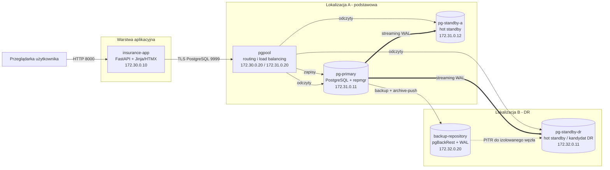
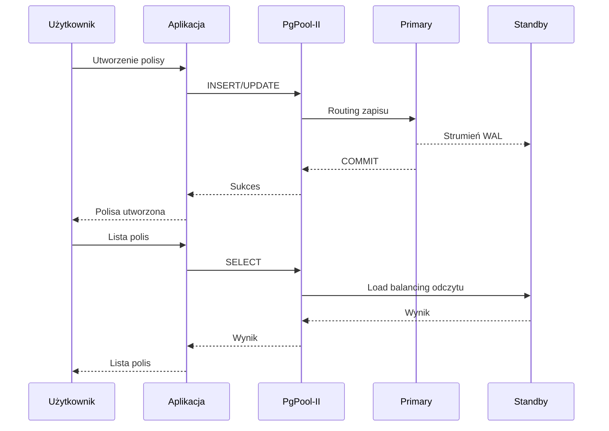

# PRD - system bazodanowy ubezpieczeń komunikacyjnych

## 1. Informacje podstawowe

| Pole | Wartość |
|---|---|
| Temat | B OUT 15 - Ubezpieczenia komunikacyjne |
| Nazwa repozytorium | `vehicle-insurance-postgresql-ha` |
| Rodzaj projektu | projekt grupowy z administrowania rozproszonymi bazami danych |
| Główna technologia | PostgreSQL 18 |
| Forma uruchomienia | kontenery Docker Compose |
| Maksymalna ocena | 70 punktów |
| Czas demonstracji | 7 minut |

## 2. Cel projektu

Celem jest zaprojektowanie i uruchomienie odpornego na awarie rozwiązania bazodanowego dla krytycznej aplikacji firmy oferującej ubezpieczenia komunikacyjne.

System ma pozwalać na:

- rejestrację klientów i pojazdów,
- przygotowywanie i aktywowanie polis,
- ewidencję zakresów ochrony oraz płatności,
- zgłaszanie i obsługę szkód,
- rejestrowanie decyzji i wypłat odszkodowań,
- kontrolowany dostęp agentów, likwidatorów szkód i audytorów,
- kontynuowanie pracy po awarii węzła lub utracie głównej lokalizacji,
- zwiększenie wydajności odczytów przez rozpraszanie zapytań,
- odzyskanie danych po omyłkowym albo złośliwym usunięciu.

Projekt ma demonstrować przede wszystkim rozwiązanie bazodanowe. Miniaplikacja webowa jest czytelnym interfejsem prezentacyjnym, a nie pełnym produktem ubezpieczeniowym.

## 3. Uzasadnienie biznesowe

Dostępność bazy jest krytyczna, ponieważ jej awaria może zatrzymać:

- wystawianie nowych polis,
- potwierdzanie aktywnej ochrony ubezpieczeniowej,
- przyjmowanie zgłoszeń szkód,
- pracę likwidatorów,
- realizację wypłat,
- obsługę kontroli i audytu.

Najgroźniejsze zdarzenia:

1. awaria bieżącego serwera primary,
2. utrata całej lokalizacji podstawowej,
3. przeciążenie serwera dużą liczbą odczytów,
4. usunięcie lub zmiana danych przez osobę z nadmiernymi uprawnieniami,
5. kradzież poświadczeń,
6. niespójność danych po nieprawidłowym przywróceniu węzła.

## 4. Założenia

### 4.1. Założenia funkcjonalne

- Jedna baza `vehicle_insurance` obsługuje demonstracyjną firmę.
- Klient może posiadać wiele pojazdów i polis.
- Polisa może obejmować jeden lub więcej pojazdów.
- Polisa zawiera co najmniej jeden zakres ochrony, np. OC, AC, Assistance lub NNW.
- Szkoda jest zgłaszana do konkretnej polisy i pojazdu.
- Szkoda posiada historię zdarzeń i może zakończyć się wypłatą.
- Operacje krytyczne są zapisywane w dzienniku audytowym.

### 4.2. Założenia techniczne

- Całość działa lokalnie w Docker Compose bez zarządzanych usług chmurowych.
- Kontenery i osobne sieci Docker symulują hosty oraz dwie fizyczne lokalizacje.
- Statyczne adresy IP są używane wyłącznie dla czytelnego diagramu i dokumentacji.
- PostgreSQL pracuje w układzie primary + dwa standby.
- Replikacja fizyczna jest zarządzana przez `repmgr`.
- PgPool-II rozdziela bezpieczne zapytania `SELECT` między węzły.
- Backup pełny i archiwizacja WAL umożliwiają Point-in-Time Recovery.
- Aplikacja webowa korzysta wyłącznie z kont bazodanowych o ograniczonych prawach.

### 4.3. Założenia demonstracyjne

- Wybór persony w aplikacji nie wymaga wpisania hasła.
- Hasła ról bazodanowych pozostają po stronie serwera aplikacji jako sekrety.
- Wybrana persona jest zapisywana w sesji przeglądarki.
- Każda persona łączy się do PostgreSQL własnym kontem, dzięki czemu odmowa dostępu jest rzeczywistą odmową bazy, a nie tylko ukryciem przycisku.
- Dane są fikcyjne i nie zawierają prawdziwych danych osobowych.

## 5. Zakres

### 5.1. Zakres obowiązkowy

- infrastruktura Docker Compose,
- trzy węzły PostgreSQL,
- replikacja fizyczna i przełączenie awaryjne,
- PgPool-II i load balancing odczytów,
- minimum dwa schematy biznesowe,
- minimum dwie grupy uprawnień,
- bezpieczne uwierzytelnianie i ograniczenia sieciowe,
- kopie zapasowe i demonstracja odtworzenia,
- przykładowy model ubezpieczeń komunikacyjnych,
- miniaplikacja webowa,
- automatyczne skrypty demonstracyjne,
- dokumentacja komend, wyników i konfiguracji,
- diagram architektury oraz ERD.

### 5.2. Poza zakresem

- integracja z zewnętrznymi rejestrami pojazdów,
- rzeczywiste płatności,
- rzeczywiste przesyłanie dokumentów i zdjęć,
- pełny system IAM lub OAuth,
- produkcyjny klaster Kubernetes,
- rzeczywiste centra danych,
- pełna taryfikacja składki,
- publiczne wdrożenie w Internecie.

## 6. Użytkownicy i persony

| Persona | Rola w organizacji | Typowe operacje |
|---|---|---|
| Anna Agent | agent ubezpieczeniowy | klienci, pojazdy, polisy, zakres ochrony |
| Piotr Likwidator | likwidator szkód | podgląd polis, rejestracja szkód, decyzje, wypłaty |
| Ewa Audytor | audytor wewnętrzny | odczyt danych i dziennika audytowego |
| Administrator techniczny | DBA/operator | klaster, backup, odtwarzanie i diagnostyka |

Administrator techniczny nie jest personą aplikacji webowej.

## 7. Wymagania funkcjonalne miniaplikacji

### FR-01. Wybór persony

Użytkownik wybiera Annę, Piotra albo Ewę z ekranu startowego. Interfejs pokazuje aktywną personę i odpowiadającą jej rolę PostgreSQL.

### FR-02. Panel główny

Panel pokazuje:

- liczbę klientów,
- liczbę aktywnych polis,
- liczbę otwartych szkód,
- sumę zatwierdzonych wypłat,
- nazwę aktualnego użytkownika bazy,
- adres węzła PostgreSQL obsługującego zapytanie.

### FR-03. Obsługa klientów

Agent może:

- wyświetlać klientów,
- dodać klienta,
- zaktualizować podstawowe dane kontaktowe.

Likwidator i audytor mogą tylko odczytywać klientów.

### FR-04. Obsługa pojazdów

Agent może dodawać i edytować pojazdy klienta. Pozostałe persony mają odczyt.

### FR-05. Obsługa polis

Agent może:

- utworzyć wersję roboczą polisy,
- przypisać pojazd,
- dobrać zakres ochrony,
- aktywować polisę demonstracyjną.

Likwidator i audytor mogą odczytywać polisy, ale nie mogą ich modyfikować.

### FR-06. Obsługa szkód

Likwidator może:

- utworzyć zgłoszenie szkody,
- zmienić status,
- dodać zdarzenie do historii,
- utworzyć decyzję o wypłacie.

Agent może zgłosić szkodę i odczytać jej podstawowy status, lecz nie może zatwierdzić wypłaty.

Audytor ma wyłącznie odczyt.

### FR-07. Audyt

Audytor może przeglądać dziennik operacji. Agent i likwidator nie mogą modyfikować tabel audytowych.

### FR-08. Prezentacja odmowy dostępu

Interfejs zawiera bezpieczne akcje demonstracyjne:

- agent próbuje utworzyć wypłatę,
- likwidator próbuje zmienić polisę,
- audytor próbuje zmienić klienta.

Aplikacja pokazuje komunikat błędu zwrócony przez PostgreSQL.

### FR-09. Prezentacja rozdzielania odczytów

Ekran diagnostyczny wykonuje serię niezależnych zapytań odczytowych i pokazuje, które węzły je obsłużyły.

### FR-10. Stan infrastruktury

Ekran demonstracyjny pokazuje:

- węzły widoczne przez `SHOW POOL_NODES`,
- bieżący primary,
- status standby,
- informację o ostatniej kopii zapasowej.

## 8. Wymagania niefunkcjonalne

### NFR-01. Dostępność

Po zatrzymaniu primary możliwe jest promowanie standby w lokalizacji zapasowej i wznowienie zapisów.

### NFR-02. Wydajność

Zapytania odczytowe mogą być kierowane do zdrowych węzłów standby. Zapisy muszą trafiać do primary.

### NFR-03. Odzyskiwanie

System umożliwia odtworzenie kopii do chwili sprzed celowego usunięcia danych.

Docelowe parametry demonstracyjne:

- RPO: maksymalnie kilka sekund dzięki archiwizacji WAL,
- RTO: do 5 minut w ręcznie sterowanym demo.

Są to cele laboratoryjne, nie gwarancje produkcyjne.

### NFR-04. Bezpieczeństwo

- `password_encryption = scram-sha-256`,
- reguły `hostssl` i połączenia TLS,
- brak `trust` dla połączeń sieciowych aplikacji,
- ograniczenie `pg_hba.conf` do konkretnych podsieci i ról,
- brak haseł w repozytorium,
- osobne konta dla person,
- zasada najmniejszych uprawnień,
- brak połączeń aplikacji jako `postgres` lub superuser,
- wewnętrzne porty administracyjne niewystawione publicznie.

### NFR-05. Powtarzalność

Środowisko musi dać się uruchomić i przygotować za pomocą udokumentowanych komend i skryptów.

### NFR-06. Obserwowalność

Status klastra jest możliwy do sprawdzenia przez:

- `repmgr cluster show`,
- `pg_stat_replication`,
- `pg_stat_wal_receiver`,
- `SHOW POOL_NODES`,
- logi kontenerów,
- status pgBackRest.

## 9. Architektura docelowa

### 9.1. Komponenty

| Komponent | Host/kontener | Lokalizacja | Funkcja |
|---|---|---|---|
| aplikacja | `insurance-app` | warstwa aplikacyjna | interfejs webowy |
| middleware | `pgpool` | lokalizacja A | routing, pooling, load balancing i health check |
| baza 1 | `pg-primary` | lokalizacja A | primary, obsługa zapisów |
| baza 2 | `pg-standby-a` | lokalizacja A | lokalny standby i odczyty |
| baza 3 | `pg-standby-dr` | lokalizacja B | replika Disaster Recovery |
| backup | `backup-repository` | lokalizacja B | repozytorium pgBackRest i WAL |

### 9.2. Plan adresacji

Adresy są planem docelowym i mogą zostać skorygowane podczas implementacji.

| Sieć | Podsieć | Host | IP |
|---|---|---|---|
| `frontend_net` | `172.30.0.0/24` | `insurance-app` | `172.30.0.10` |
| `frontend_net` | `172.30.0.0/24` | `pgpool` | `172.30.0.20` |
| `site_a_net` | `172.31.0.0/24` | `pg-primary` | `172.31.0.11` |
| `site_a_net` | `172.31.0.0/24` | `pg-standby-a` | `172.31.0.12` |
| `site_a_net` | `172.31.0.0/24` | `pgpool` | `172.31.0.20` |
| `site_b_net` | `172.32.0.0/24` | `pg-standby-dr` | `172.32.0.11` |
| `site_b_net` | `172.32.0.0/24` | `backup-repository` | `172.32.0.20` |
| `site_b_net` | `172.32.0.0/24` | `pgpool` | `172.32.0.30` |

### 9.3. Diagram architektury



### 9.4. Przepływ zapisu i odczytu



## 10. Mechanizm wysokiej dostępności

### 10.1. Replikacja

- fizyczna replikacja strumieniowa PostgreSQL,
- primary wysyła WAL do dwóch standby,
- `hot_standby = on`,
- sloty replikacyjne ograniczają ryzyko usunięcia potrzebnych segmentów WAL,
- `repmgr` przechowuje metadane i ułatwia klonowanie, monitoring, switchover i failover.

### 10.2. Scenariusz utraty lokalizacji A

1. Zatrzymane zostają `pg-primary` i `pg-standby-a`.
2. `pg-standby-dr` jest promowany do primary.
3. Konfiguracja PgPool-II odświeża rolę backendu.
4. Aplikacja ponawia połączenie.
5. Wykonywany jest zapis kontrolny na nowym primary.
6. Stary primary pozostaje odłączony, aby uniknąć split-brain.
7. Po powrocie lokalizacji stary węzeł jest odtwarzany lub dołączany przez `repmgr node rejoin`/`pg_rewind`.

### 10.3. Switchover a failover

- switchover: planowane przełączenie podczas prac technicznych,
- failover: przełączenie po awarii.

Projekt powinien zawierać oba skrypty, ale siedmiominutowe demo wykorzysta jeden deterministyczny scenariusz failover.

## 11. Mechanizm zwiększania wydajności

PgPool-II pracuje w trybie streaming replication:

- wykrywa primary i standby,
- wysyła zapisy do primary,
- rozdziela kwalifikujące się `SELECT` między zdrowe backendy,
- sprawdza stan węzłów,
- monitoruje opóźnienie replikacji,
- nie kieruje odczytu do nadmiernie opóźnionego standby.

Dowód działania:

1. wykonanie 60 niezależnych zapytań `SELECT inet_server_addr()`,
2. pogrupowanie wyników według adresu,
3. `SHOW POOL_NODES`,
4. ponowienie testu po wyłączeniu jednego standby.

Nie używamy natywnej replikacji PgPool-II, ponieważ po powrocie węzła mogłaby powstać niespójność znana z laboratorium.

## 12. Backup i odtwarzanie

### 12.1. Strategia

Podstawowy mechanizm:

- pgBackRest,
- pełna kopia bazy,
- archiwizacja WAL,
- repozytorium w symulowanej lokalizacji B,
- retencja co najmniej dwóch pełnych kopii w środowisku demonstracyjnym.

Dodatkowy eksport logiczny:

- `pg_dump --format=custom`,
- używany jako przenośna kopia struktury i małego zbioru demonstracyjnego,
- nie zastępuje PITR.

### 12.2. Scenariusz odzyskiwania po ataku

1. Utworzenie rekordu oznaczonego jako chroniony.
2. Zapisanie czasu kontrolnego.
3. Wykonanie pełnego backupu i potwierdzenie statusu.
4. Usunięcie rekordu.
5. Odtworzenie klastra do chwili sprzed `DELETE` w izolowanym kontenerze `pg-restore`.
6. Potwierdzenie obecności rekordu.
7. Opcjonalnie eksport odzyskanego rekordu i bezpieczne przywrócenie go do klastra aktywnego.

Odtwarzanie jest wykonywane do osobnego katalogu danych, aby demonstracja nie niszczyła aktywnego środowiska.

## 13. Bezpieczeństwo

### 13.1. Uwierzytelnianie

- SCRAM-SHA-256 dla kont aplikacyjnych i technicznych,
- TLS dla połączeń sieciowych,
- `sslmode=verify-ca` lub co najmniej `require` w środowisku demonstracyjnym,
- brak hasła w adresie URL zapisanym w repozytorium,
- sekrety ładowane z lokalnego `.env`.

### 13.2. Sieć

Przykładowa polityka `pg_hba.conf`:

- konta aplikacji mogą łączyć się tylko z adresu/podsieci PgPool-II,
- konto replikacji tylko z podsieci lokalizacji A i B,
- konto pgBackRest tylko z hosta repozytorium,
- konto monitoringu tylko z PgPool-II,
- brak reguł `0.0.0.0/0` dla kont biznesowych,
- reguły bardziej szczegółowe znajdują się przed ogólnymi.

### 13.3. Autoryzacja

Role grupowe bez logowania:

- `grp_agent`,
- `grp_claims_adjuster`,
- `grp_auditor`,
- `grp_app_readonly`,
- techniczne: `role_replication`, `role_monitor`, `role_backup`.

Role logujące:

- `app_agent_anna`,
- `app_adjuster_piotr`,
- `app_auditor_ewa`.

Uprawnienia są nadawane grupom, nie pojedynczym użytkownikom.

### 13.4. Ochrona danych

- kolumny PESEL i VIN posiadają ograniczenia formatu,
- unikalność numerów klienta, VIN i polisy,
- wypłata nie może być ujemna,
- zakres dat polisy musi być poprawny,
- klucze obce chronią relacje,
- krytyczne operacje są audytowane,
- aplikacja używa zapytań parametryzowanych.

## 14. Model logiczny

Baza `vehicle_insurance` zawiera cztery schematy biznesowe:

| Schemat | Odpowiedzialność |
|---|---|
| `identity` | klienci i dane kontaktowe |
| `insurance` | pojazdy, polisy, zakresy i płatności |
| `claims` | szkody, historia obsługi i wypłaty |
| `audit` | niezmienialny dziennik operacji |

Szczegółowy model znajduje się w [DATABASE_DESIGN.md](DATABASE_DESIGN.md).

## 15. Technologia miniaplikacji

Rekomendowany stos:

- Python,
- FastAPI,
- Jinja2,
- HTMX lub prosty JavaScript,
- Bootstrap z lokalnych plików albo prosty CSS,
- psycopg 3,
- pytest,
- Docker.

Powody:

- mało kodu infrastrukturalnego,
- szybki interfejs serwerowy,
- brak konieczności budowania rozbudowanego SPA,
- łatwe wykonanie zapytań różnymi kontami PostgreSQL,
- czytelne demo.

## 16. Proponowana struktura repozytorium

```text
vehicle-insurance-postgresql-ha/
|-- README.md
|-- .env.example
|-- .gitignore
|-- docker-compose.yml
|-- Makefile lub scripts/
|-- app/
|   |-- Dockerfile
|   |-- requirements.txt lub pyproject.toml
|   |-- src/
|   |-- templates/
|   |-- static/
|   `-- tests/
|-- database/
|   |-- Dockerfile
|   |-- migrations/
|   |-- seed/
|   |-- roles/
|   `-- audit/
|-- infrastructure/
|   |-- postgres/
|   |-- repmgr/
|   |-- pgpool/
|   |-- pgbackrest/
|   |-- certificates/
|   `-- networks/
|-- scripts/
|   |-- setup/
|   |-- demo/
|   |-- backup/
|   |-- failover/
|   `-- evidence/
|-- docs/
|   |-- PRD.md
|   |-- DATABASE_DESIGN.md
|   |-- IMPLEMENTATION_PLAN.md
|   |-- architecture/
|   |-- evidence/
|   `-- final-report/
`-- output/
    `-- submission/
```

## 17. Mapowanie na kryteria oceny

| Kryterium | Punkty | Element projektu | Dowód |
|---|---:|---|---|
| założenia aplikacji | 5 | sekcje 2-4 PRD | opis i wymagania |
| diagram architektury | 10 | sekcja 9 | Mermaid + eksport PNG/PDF |
| minimum 2 schematy | 5 | cztery schematy | `\dn`, tabele i ERD |
| minimum 2 grupy | 5 | agent, likwidator, audytor | `\du`, GRANT i testy odmowy |
| replikacja/DR | 15 | primary + 2 standby + repmgr | failover lokalizacji A |
| wydajność | 15 | PgPool-II + odczyty standby | 60 zapytań i wyniki per węzeł |
| kopia zapasowa | 5 | pgBackRest + WAL/PITR | odzyskanie usuniętego rekordu |
| bezpieczeństwo | 10 | TLS, SCRAM, pg_hba, least privilege | konfiguracje i testy |

## 18. Kryteria akceptacji całości

Projekt jest gotowy, gdy:

1. `docker compose up` uruchamia wszystkie wymagane komponenty.
2. Klaster pokazuje jeden primary i dwa standby.
3. Rekord zapisany na primary jest widoczny na obu standby.
4. PgPool-II rozdziela odczyty i kieruje zapisy do primary.
5. Awaria primary nie powoduje utraty możliwości wznowienia zapisów po failover.
6. Aplikacja prezentuje trzy persony i rzeczywiste różnice uprawnień.
7. Istnieją co najmniej cztery schematy i trzy grupy uprawnień.
8. Konto bez prawa do operacji otrzymuje błąd PostgreSQL.
9. Po usunięciu rekordu można go odzyskać z PITR.
10. Wszystkie sekrety są poza repozytorium.
11. Dokumentacja zawiera komendy, wyniki i przypisanie do hostów.
12. Scenariusz demonstracyjny mieści się w 7 minutach.

## 19. Ryzyka

| Ryzyko | Skutek | Ograniczenie |
|---|---|---|
| zbyt wiele komponentów | niestabilne demo | osobne skrypty setup/demo i zamrożony stan przed prezentacją |
| PgPool-II błędnie rozpoznaje role | zapis nie trafia do primary | streaming replication checks i test integracyjny |
| split-brain po failover | rozbieżne dane | fencing starego primary i kontrolowany rejoin |
| brak segmentu WAL | niemożliwy PITR | monitoring archive-push i test restore przed oddaniem |
| opóźniony standby zwraca stare dane | niespójny odczyt | `delay_threshold` i demonstracja ograniczeń |
| hasła trafią do Git | utrata punktów bezpieczeństwa | `.gitignore`, `.env.example`, skan przed commitem |
| demo przekroczy 7 minut | niepełna prezentacja | krótki scenariusz i przygotowane dane |
| aplikacja przesłoni część bazodanową | zła proporcja pracy | aplikacja pozostaje mała, a główny nacisk pada na PostgreSQL |

## 20. Definition of Done

Każdy etap jest zakończony dopiero wtedy, gdy:

- kod lub konfiguracja znajduje się w repozytorium,
- istnieje instrukcja uruchomienia,
- istnieje automatyczny albo ręczny test,
- wynik testu został zapisany,
- nie ma jawnych sekretów,
- zmiana jest powiązana z wymaganiem i kryterium oceny.

