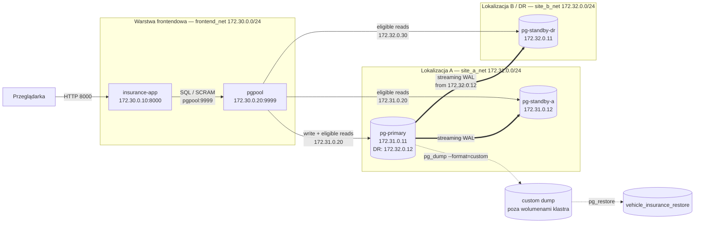

# Kontrakt architektoniczny

Status: zaakceptowany kontrakt docelowy; bieżący Compose zawiera właściwe
obrazy PostgreSQL/repmgr, PgPool-II oraz miniaplikację demonstracyjną.

Dokument zamraża nazwy, adresy, przepływy, granice bezpieczeństwa i
odpowiedzialność komponentów. Zmiana interfejsu wymaga koordynacji przez
`project-integrator`.

## 1. Uzasadnienie architektury

System ubezpieczeń komunikacyjnych wymaga jednocześnie:

- ciągłości sprzedaży polis;
- całodobowego dostępu do obsługi szkód;
- obsługi przewagi zapytań odczytowych;
- rozdzielenia obowiązków agentów, likwidatorów i audytorów;
- przeżycia awarii całej lokalizacji podstawowej;
- niezależnego odzyskania danych po błędnym `DELETE`.

Replikacja fizyczna rozwiązuje problem dostępności i DR, PgPool-II daje jeden
endpoint i rozkłada odczyty, role PostgreSQL wymuszają podział obowiązków, a
logiczny dump chroni przed błędem, który zostałby skopiowany na wszystkie
standby.

## 2. Inwentarz zgodny z Compose

Compose definiuje:

- 5 usług;
- 3 sieci;
- 3 nazwane wolumeny danych;
- 2 symulowane lokalizacje bazodanowe.

### Usługi i adresacja

| Usługa | Sieć i adres | Port kontenera | Ekspozycja hosta |
|---|---|---:|---|
| `insurance-app` | `frontend_net` `172.30.0.10` | 8000 | `${APP_HOST_PORT}:8000` |
| `pgpool` | `frontend_net` `172.30.0.20` | 9999 | `127.0.0.1:${PGPOOL_HOST_PORT}` |
| `pgpool` | `site_a_net` `172.31.0.20` | 9999 | brak |
| `pgpool` | `site_b_net` `172.32.0.30` | 9999 | brak |
| `pg-primary` | `site_a_net` `172.31.0.11` | 5432 | brak |
| `pg-primary` | `site_b_net` `172.32.0.12` | 5432 | brak |
| `pg-standby-a` | `site_a_net` `172.31.0.12` | 5432 | brak |
| `pg-standby-dr` | `site_b_net` `172.32.0.11` | 5432 | brak |

`pg-primary` ma interfejs w obu sieciach lokalizacyjnych, aby wysyłać WAL do
DR bez publikowania PostgreSQL na hoście. PgPool-II łączy warstwę aplikacyjną z
obydwoma segmentami bazodanowymi.

### Sieci

| Sieć | Podsieć | Charakter |
|---|---|---|
| `frontend_net` | `172.30.0.0/24` | aplikacja i endpoint PgPool-II |
| `site_a_net` | `172.31.0.0/24` | prywatna lokalizacja A |
| `site_b_net` | `172.32.0.0/24` | prywatna lokalizacja B/DR i łącze WAL |

`site_a_net` i `site_b_net` są sieciami `internal`. Lokalizacja A zawiera
`pg-primary` i `pg-standby-a`; lokalizacja B zawiera `pg-standby-dr`.
Middleware oraz aplikacja są warstwami logicznymi, nie dodatkowymi
lokalizacjami bazodanowymi.

### Wolumeny

| Wolumen | Montowany przez |
|---|---|
| `pg_primary_data` | `pg-primary` |
| `pg_standby_a_data` | `pg-standby-a` |
| `pg_standby_dr_data` | `pg-standby-dr` |

Dump nie jest zapisywany w żadnym z tych wolumenów.

## 3. Diagram

Źródłowa wersja Mermaid znajduje się w
[architecture.mmd](architecture.mmd). Eksport do PNG lub PDF jest wykonywany
lokalnie na potrzeby paczki zaliczeniowej, bez usług zewnętrznych.
Węzły `custom dump` i `vehicle_insurance_restore` oznaczają artefakt oraz
przepływ administracyjny; nie są dodatkowymi usługami Compose.

## 4. Przepływy sieciowe

| Źródło | Cel | Port | Przeznaczenie |
|---|---|---:|---|
| przeglądarka | `insurance-app` | 8000/TCP | interfejs demonstracyjny |
| `insurance-app` | `pgpool` | 9999/TCP | jedyny endpoint SQL aplikacji |
| `pgpool` | trzy węzły PostgreSQL | 5432/TCP | routing, health check i odczyty |
| `pg-primary` | `pg-standby-a` | 5432/TCP | fizyczna replikacja WAL |
| `pg-primary` | `pg-standby-dr` | 5432/TCP | fizyczna replikacja WAL do DR |
| operator/skrypt | aktywna baza | 5432 przez kontrolowany endpoint | dump i administracja |

PCP i porty PostgreSQL nie są publikowane na hoście. Połączenia bazodanowe
używają SCRAM-SHA-256. TLS jest opcjonalny.

## 5. Kontrakt HA i failover

- `pg-primary` jest początkowym primary.
- Oba standby korzystają z fizycznej replikacji strumieniowej.
- repmgr rejestruje klaster i wspiera ręczny failover.
- Utrata lokalizacji A oznacza zatrzymanie `pg-primary` i `pg-standby-a`.
- Przed promocją DR operator potwierdza fencing starego primary.
- `pg-standby-dr` jest promowany ręcznie.
- PgPool-II aktualizuje rolę backendu, a aplikacja zachowuje endpoint.
- Zapis kontrolny potwierdza działanie nowego primary.
- Powrót starych węzłów wymaga kontrolowanego rejoin lub ponownego klonowania.

Automatyczny failover, automatyczny rejoin i `pg_rewind` są rozszerzeniami.

## 6. Kontrakt routingu

PgPool-II działa w trybie streaming replication:

- rozpoznaje role backendów;
- wysyła zapisy do primary;
- rozdziela kwalifikujące się `SELECT`;
- wykonuje health check i SR check;
- wyklucza niedostępny lub nadmiernie opóźniony backend;
- udostępnia `SHOW POOL_NODES`.

Projekt nie używa natywnej replikacji PgPool-II.

## 7. Kontrakt backupu

Obowiązkowy mechanizm to:

- `pg_dump --format=custom`;
- katalog hosta lub dedykowany katalog roboczy poza trzema wolumenami PGDATA;
- artefakt ignorowany przez Git;
- `pg_restore` do `vehicle_insurance_restore`;
- pokazanie rekordu usuniętego z aktywnego klastra.

Replikacja i backup pełnią różne funkcje. Replikacja skraca niedostępność, ale
przenosi błędny `DELETE`; dump zachowuje niezależny punkt logiczny.

## 8. Kontrakt danych i bezpieczeństwa

- baza: `vehicle_insurance`;
- schematy: `insurance`, `claims`, `audit`;
- liczba tabel MVP: 8;
- grupy: `grp_agent`, `grp_claims_adjuster`, `grp_auditor`;
- role logujące: `app_agent_anna`, `app_adjuster_piotr`, `app_auditor_ewa`;
- role techniczne o ograniczonym celu: replikacja, monitoring, backup i repmgr.

Aplikacja nie używa `postgres`, superusera ani właściciela bazy. `pg_hba.conf`
ogranicza rolę i źródło połączenia. Nie ma sieciowego `trust` ani biznesowych
reguł dla `0.0.0.0/0`.

## 9. Własność

- `database/` — `database-engineer`;
- `infrastructure/postgres/`, `infrastructure/repmgr/`,
  `infrastructure/pgpool/`, `scripts/failover/` i Compose —
  `infrastructure-engineer` z przeglądem integratora;
- `scripts/backup/` — `backup-recovery-engineer`;
- `app/` — `application-engineer`;
- dokumenty przekrojowe, demo i dowody — `project-integrator`.

## 10. Decyzje

- [ADR-0001](adr/0001-physical-streaming-replication.md) — fizyczna replikacja;
- [ADR-0002](adr/0002-pgpool-routing.md) — PgPool-II jako endpoint;
- [ADR-0003](adr/0003-pg-dump-pg-restore.md) — logiczny dump i oddzielny restore;
- [ADR-0004](adr/0004-fastapi-server-rendered-ui.md) — mała aplikacja
  renderowana serwerowo.

## 11. Elementy opcjonalne

TLS, pgBackRest/PITR, `repmgrd`, automatyczny rejoin, `pg_rewind`, Watchdog,
rozbudowany CRUD i panel infrastruktury nie są częścią kontraktu
obowiązkowego.
